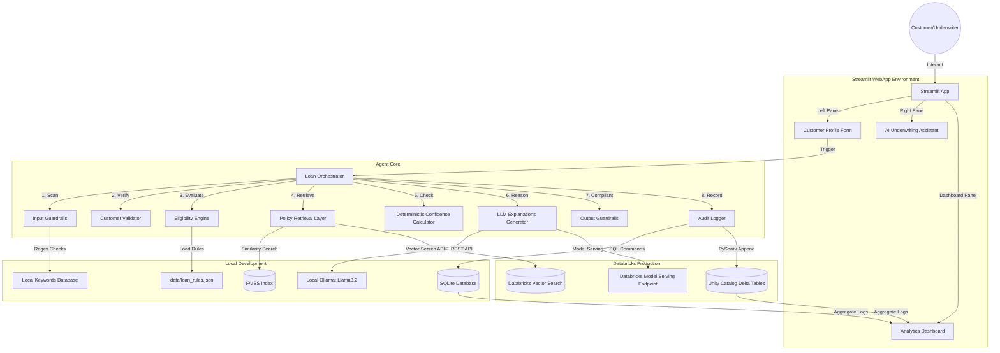

# System Architecture Diagram & Technical Description

The **Intelligent Loan Eligibility Assessment App** is an Agentic AI solution deployed as a WebApp. Below is the architecture mapping local development runtime and Databricks production environments.

## Technical Architecture

## Core Infrastructure Mapping

1. **Streamlit Tier**:
   - Deployed on **Databricks Apps** in production for secure workspace hosting.
   - Hosted locally on Python dev server.

2. **Database & Storage**:
   - **Local Mode**: Logs stored in local `loan_assessment_logs.db` SQLite table.
   - **Prod Mode**: Appends logs to a registered UC Delta table `main.loan_eligibility.loan_assessment_logs`.

3. **Language Models (LLM)**:
   - **Local Mode**: Integrates with offline Ollama endpoints (`llama3.2`).
   - **Prod Mode**: Calls high-throughput Databricks Foundation model endpoints (e.g. `meta-llama-3-1-70b-instruct`).

4. **Policy Vector Search**:
   - **Local Mode**: Loads a serialized FAISS vector store generated from PDF policy chunks.
   - **Prod Mode**: Connects directly to a synchronized Delta-Sync Vector Search index in Unity Catalog.
