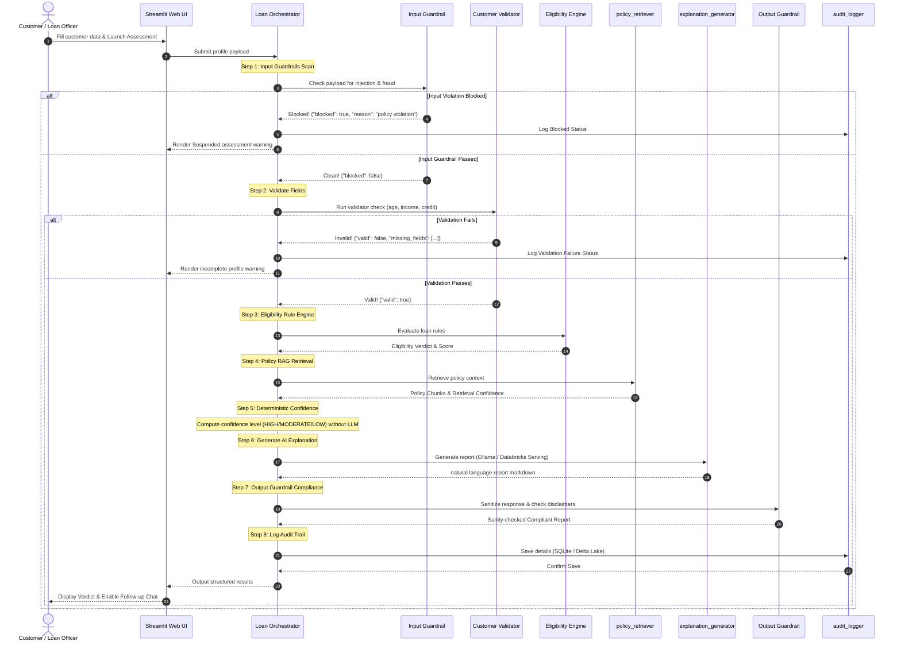

# Agent Execution Workflow & Sequence Diagram

The **Loan Orchestrator** governs a sequential multi-stage evaluation pipeline to ensure safety, validation, deterministic rules execution, and compliance.

## Agent Sequence Flow

## Description of Stages

1. **Input Guardrail**: Scans the input text for SQL/Prompt injection terms (e.g. `ignore policy`, `approve anyway`) and fake credential requests.
2. **Customer Validator**: Ensures type correctness and boundary limits for data items (e.g., credit scores between 300 and 900).
3. **Eligibility Engine**: A pure Python deterministic rules check loading thresholds from `loan_rules.json`. No LLM hallucination is permitted here.
4. **Policy Retriever**: Queries vector store database. Supports local FAISS or synchronized Databricks Vector Search index.
5. **Confidence Engine**: Evaluates decision outcome parameters deterministically. Returns HIGH for approval, MODERATE for conditional approval, and LOW for rejections.
6. **Explanation Generator**: Invokes the language model to synthesize context details, rules output, and retrieved policy into a readable markdown report.
7. **Output Guardrail**: Validates the reasoning text, sanitizes over-promising sentences, and injects mandatory disclaimer boxes.
8. **Audit Logging**: Persists transactional metrics (application ID, session, timestamp, inputs, verdict, latency) for dashboard analytics.
